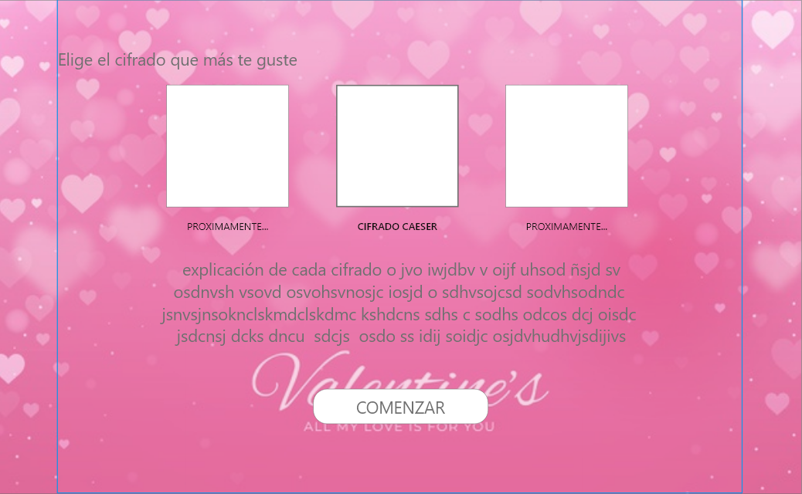
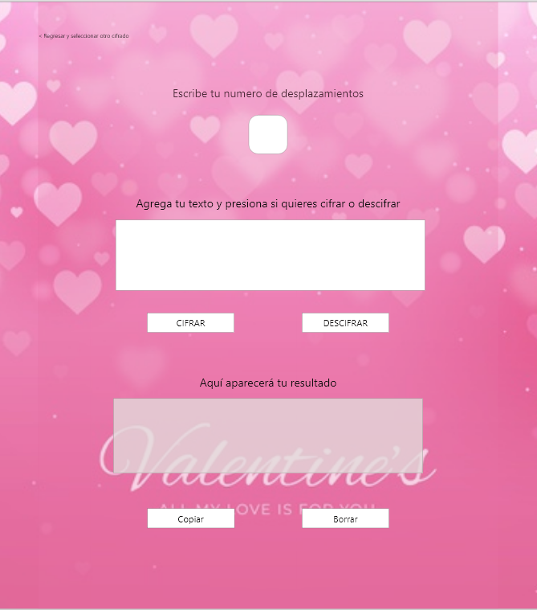

# Cifrado César

El siguiente proyecto permite codificar y decodificar mensajes mediante el "Cifrado César".
El cifrado César es uno de los primeros métodos de cifrado conocidos históricamente. Julio César lo usó para enviar órdenes a sus generales en los campos de batalla. Este consistía en escribir el mensaje con un alfabeto que estaba formado por las letras del alfabeto latino normal desplazadas tres posiciones a la derecha.

#Usuarios
Los principales usuarios en los que se piensa el uso de este proyecto es para jovenes y adultos que busquen privacidad en ciertos mensajes.
Una aplicación facil de entender y utilizar.

#Prototipo y feedback

El feedback fue mas que nada con mis compañeras, las cuales me aconsejaran que mi app no sea muy compleja y de facil entendimiento para el usuario.

#Wireframe

#Resultado

