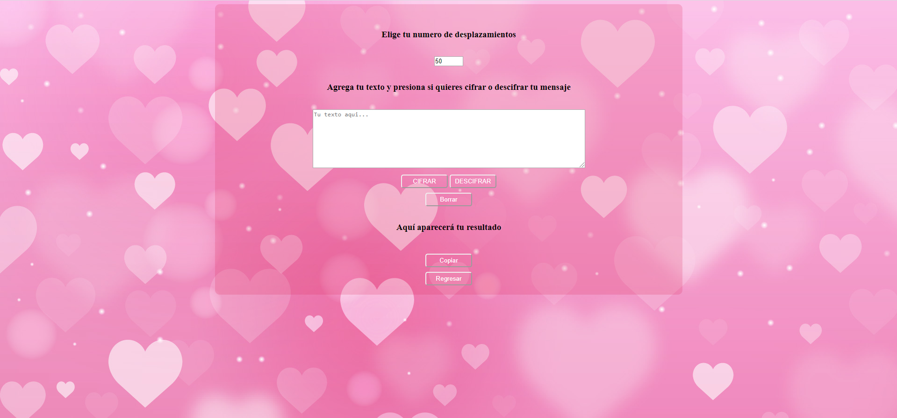

# Cifrado César

El siguiente proyecto permite codificar y decodificar mensajes mediante el "Cifrado César".
El cifrado César es uno de los primeros métodos de cifrado conocidos históricamente. Julio César lo usó para enviar órdenes a sus generales en los campos de batalla. Este consistía en escribir el mensaje con un alfabeto que estaba formado por las letras del alfabeto latino normal desplazadas tres posiciones a la derecha.

## Usuarios
Los principales usuarios en los que se piensa el uso de este proyecto es para jovenes y adultos que busquen privacidad en ciertos mensajes.
Una aplicación facil de entender y utilizar.

## Prototipo y feedback

El feedback fue mas que nada con mis compañeras, las cuales me aconsejaran que mi app no sea muy compleja y de facil entendimiento para el usuario.

## Wireframe

## Resultado

## Objetivos de aprendizaje
El objetivo principal de aprendizaje es adquirir experiencia desarrollando aplicaciones web (WebApp) que interactúen con el usuario a través del navegador y la lógica, utilizando HTML5, CCS3 y JavaScript como herramientas.

Reflexiona y luego marca los objetivos que has llegado a entender y aplicar en tu proyecto.

 **UX**
 - [x] Diseñar la aplicación pensando y entendiendo al usuario.
 - [x] Crear prototipos para obtener feedback e iterar.
 - Aplicar los principios de diseño visual (contraste, alineación, jerarquía).

 **HTML y CSS**
 - [x] Uso correcto de HTML semántico.
 - [x] Uso de selectores de CSS.
 - [x] Construir tu aplicación respetando el diseño realizado (maquetación).

 **DOM**
 - [x] Uso de selectores del DOM.
 - [x] Manejo de eventos del DOM.
 - [x] Manipulación dinámica del DOM.

 **Javascript**
 - [x] Manipulación de strings.
 - [] Uso de condicionales (if-else | switch).
 - [] Uso de bucles (for | do-while).
 - [x] Uso de funciones (parámetros | argumentos | valor de retorno).
 - [] Declaración correcta de variables (const & let).

 **Testing**
 - [] Testeo de tus funciones.

 **Git y GitHub**
 - [] Comandos de git (add | commit | pull | status | push).
 - [x] Manejo de repositorios de GitHub (clone | fork | gh-pages).

 **Buenas prácticas de desarrollo**
 - Uso de identificadores descriptivos (Nomenclatura | Semántica).
 - Uso de linter para seguir buenas prácticas (ESLINT).
